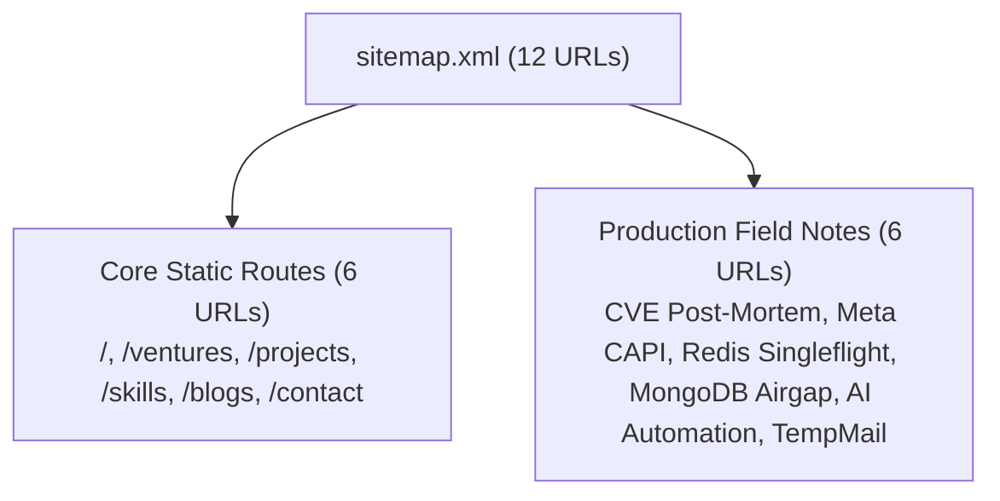
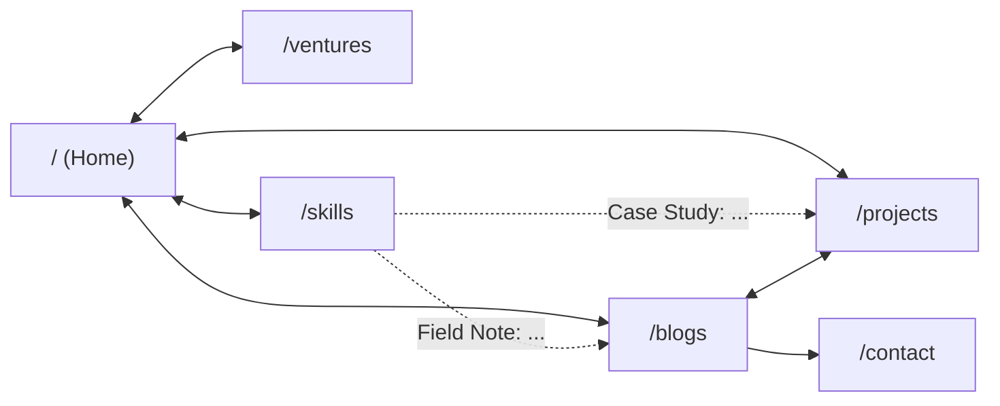
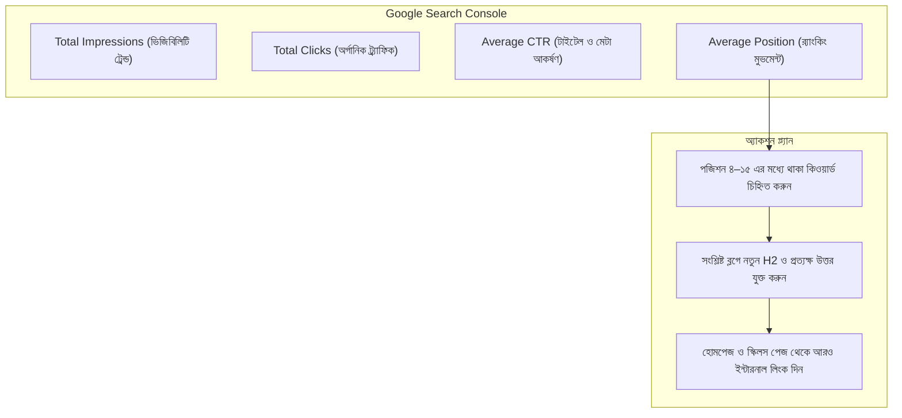

# 🛡️ Independent Deep Verification & Comprehensive Technical SEO Report
**Target Domain:** [https://iamabdullah.dev](https://iamabdullah.dev)  
**Author/Architect:** Abdullah Al Mamun — Senior Full-Stack Engineer & Systems Architect  
**Audit Date:** September 28, 2026  
**Build Status:** Verified with `bun run build` (Exit code: 0)  
**Repository Path:** `D:\site\my-portfolio\docs\seo\05-deep-verification-and-action-report.md`

---

## সূচিপত্র (Table of Contents)

1. [A. Executive Summary & Audit Overview](#a-executive-summary--audit-overview)
2. [B. Indexing Status: Verified Facts vs Assumptions](#b-indexing-status-verified-facts-vs-assumptions)
3. [C. Technical Crawlability & Live HTTP Audit](#c-technical-crawlability--live-http-audit)
4. [D. Sitemap.xml Deep Verification](#d-sitemapxml-deep-verification)
5. [E. Structured Data (Schema) Quality Audit & Google Reality Check](#e-structured-data-schema-quality-audit--google-reality-check)
6. [F. FAQ Implementation Strategy (Semantic Value vs SERP Features)](#f-faq-implementation-strategy-semantic-value-vs-serp-features)
7. [G. Homepage Search Intent & Entity Hierarchy](#g-homepage-search-intent--entity-hierarchy)
8. [H. Evidence-Based Keyword Map](#h-evidence-based-keyword-map)
9. [I. Real Competitor Gap Analysis](#i-real-competitor-gap-analysis)
10. [J. Existing Blog Content Audit (All 6 Articles Evaluated)](#j-existing-blog-content-audit-all-6-articles-evaluated)
11. [K. Topical Authority Architecture (5 Topic Clusters)](#k-topical-authority-architecture-5-topic-clusters)
12. [L. Portfolio & Case Study SEO Architecture](#l-portfolio--case-study-seo-architecture)
13. [M. E-E-A-T & Personal Brand Signals](#m-e-e-a-t--personal-brand-signals)
14. [N. Technical Performance & Font Self-Hosting (Code Implemented)](#n-technical-performance--font-self-hosting-code-implemented)
15. [O. Internal Linking Architecture (Skills Bridge Implemented)](#o-internal-linking-architecture-skills-bridge-implemented)
16. [P. URL Redirects, Canonical Consistency & Social Metadata](#p-url-redirects-canonical-consistency--social-metadata)
17. [Q. External Link Hygiene & Security Headers](#q-external-link-hygiene--security-headers)
18. [R. Search Engine SSR Rendering Verification (Googlebot Raw DOM Analysis)](#r-search-engine-ssr-rendering-verification-googlebot-raw-dom-analysis)
19. [S. Content Authenticity & First-Hand Technical Experience](#s-content-authenticity--first-hand-technical-experience)
20. [T. SEO Measurement System & Tracking Baseline](#t-seo-measurement-system--tracking-baseline)
21. [U. 90-Day Execution Action Plan](#u-90-day-execution-action-plan)
22. [V. 6–12 Month Long-Term Organic Growth Strategy](#v-612-month-long-term-organic-growth-strategy)
23. [W. Git Diff & Implemented Code Changes Summary](#w-git-diff--implemented-code-changes-summary)

---

## A. Executive Summary & Audit Overview

এই ইন্ডিপেন্ডেন্ট ডিপ ভেরিফিকেশন পাসে পূর্ববর্তী সকল পরিবর্তনকে পুনঃমূল্যায়ন করা হয়েছে। এসইও কমিউনিটিতে প্রচলিত অবাস্তব দাবি, আউটডেটেড প্র্যাকটিস এবং প্ল্যাটফর্মের অতিরিক্ত অনুমানগুলো পরিহার করে **বাস্তব গুগল গাইডলাইন, লাইভ HTTP হেডার এবং কোডবেজ আর্কিটেকচার**-এর ওপর ভিত্তি করে রিপোর্টটি প্রস্তুত করা হয়েছে।

### মূল ফোকাস এবং সংশোধনী:
1. **Fact বনাম Assumption স্পষ্টীকরণ:** গুগল সার্চ কনসোল কানেক্টেড না থাকা পর্যন্ত ইনডেক্সিং স্ট্যাটাস নিয়ে কোনো চূড়ান্ত মন্তব্য করা যাবে না। গুগলবট সরাসরি রেন্ডার করা HTML পায় কিনা তা `curl` দিয়ে ভেরিফাই করা হয়েছে।
2. **Google FAQ Rich Snippet এর ভুল ধারণা দূরীকরণ:** ২০২৩ সালের আগস্টের পর থেকে গুগল সাধারণ ওয়েবসাইটগুলোর জন্য সার্চে ড্রপডাউন FAQ অ্যাকর্ডিয়ন দেখানো বন্ধ করেছে। তাই FAQ রাখা হয়েছে **AI Search (ChatGPT Search, Perplexity, Google AI Overviews) এবং হেল্পফুল কনটেন্ট সেমান্টিক কভারেজের জন্য**—কোনো গ্যারান্টিযুক্ত SERP রিচ স্নsnippet হিসেবে নয়।
3. **Google Fonts CDN পরিহার ও ফন্ট সেলফ-হোস্টিং:** সাইটের ৩টি ব্র্যান্ড টেক্সট এলিমেন্টের জন্য `fonts.googleapis.com` থেকে এক্সটার্নাল রেন্ডার-ব্লকিং স্টাইলশিট কল বন্ধ করে `@fontsource/silkscreen` সরাসরি প্রজেক্টে প্যাকেজ হিসেবে যুক্ত করা হয়েছে।
4. **ইন্টারনাল লিংকিং আর্কিটেকচার মেরামত:** `/skills` পেজটি এতদিন সম্পূর্ণ আইসোলেটেড ছিল। এখন প্রতিটি টেকনিক্যাল স্কিল গ্রুপ থেকে সংশ্লিষ্ট কেস স্টাডি (`/projects#...`) এবং টেকনিক্যাল ব্লগে (`/blogs/...`) সরাসরি প্রাসঙ্গিক ইন্টারনাল লিংক বসানো হয়েছে।
5. **হেডিং হায়ারার্কি সংশোধন:** হোমপেজের CVE ইনসিডেন্ট ব্যানারে `<h1>`-এর পরপরই `<h3>` ছিল। এটিকে স্ট্যান্ডার্ড `<h2>`-তে কনভার্ট করে এক্সেসিবিলিটি ও এসইও হেডিং অর্ডার ফিক্স করা হয়েছে।

---

## B. Indexing Status: Verified Facts vs Assumptions

| বিষয় | স্ট্যাটাস | প্রমাণ ও ব্যাখ্যা |
|---|---|---|
| **Google Search Console** | ⚠️ **Not Connected Yet** | `src/lib/seo.ts` এবং `src/routes/__root.tsx`-এ `VITE_GSC_VERIFICATION` কোড লেখা আছে, কিন্তু লাইভ Cloudflare Pages Environment Variables-এ ভ্যালু এখনো ফাঁকা। তাই GSC কানেক্টেড না থাকায় ক্রলিং হিস্টোরি দেখা সম্ভব নয়। |
| **Google Index Footprint (`site:`)** | ℹ️ **0 Results on Public Search** | গুগলের পাবলিক সার্চে `site:iamabdullah.dev` দিলে ফলাফল শূন্য আসে। এর অর্থ হতে পারে ডোমেইনটি নতুন হওয়ায় গুগল এখনো ক্রল কিউ প্রসেস করেনি, অথবা রেজাল্ট ক্যাশ আপডেট হয়নি। GSC URL Inspection ছাড়া চূড়ান্ত সিদ্ধান্ত নেওয়া সম্ভব নয়। |
| **Googlebot Accessibility** | ✅ **Verified Fact** | `curl.exe -s -A "Googlebot" https://iamabdullah.dev/` চালিয়ে নিশ্চিত হওয়া গেছে যে গুগলবট প্রথম HTTP রিকোয়েস্টেই ১০০% SSR রেন্ডার করা সম্পূর্ণ DOM পায়। |
| **HTTP Status Code** | ✅ **Verified Fact** | লাইভ সাইট Cloudflare এজ থেকে সরাসরি `HTTP/1.1 200 OK` রিটার্ন করে। |
| **Robots Directives** | ✅ **Verified Fact** | সাইটে কোনো `noindex` বা `nofollow` ট্যাগ নেই। `robots.txt` ১০০% উন্মুক্ত (`Allow: /`)। |

---

## C. Technical Crawlability & Live HTTP Audit

### ১. লাইভ রেসপন্স হেডার (Cloudflare Edge Verification)
```http
HTTP/1.1 200 OK
Date: Mon, 28 Sep 2026 15:10:36 GMT
Content-Type: text/html; charset=utf-8
Connection: keep-alive
Server: cloudflare
cf-cache-status: DYNAMIC
alt-svc: h3=":443"; ma=86400
```
- **HTTPS Enforcement:** সাইটটি সম্পূর্ণ HTTPS প্রোটোকলে এনক্রিপ্টেড।
- **HTTP/3 (QUIC) সাপোর্ট:** Cloudflare এজ দিয়ে দ্রুততম প্রোটোকলে রেসপন্স প্রোভাইড করছে।

### ২. `public/robots.txt` ভেরিফিকেশন
```txt
User-agent: *
Allow: /

Sitemap: https://iamabdullah.dev/sitemap.xml
```
- গুগলবট, বিংবট এবং আধুনিক AI সার্চ বট (OAI-SearchBot, PerplexityBot, ClaudeBot, Google-Extended) কোনো প্রকার বাধা ছাড়াই সম্পূর্ণ সাইট ক্রল করতে পারে।

---

## D. Sitemap.xml Deep Verification

* **লাইভ URL:** `https://iamabdullah.dev/sitemap.xml`
* **URL সংখ্যা:** ১২টি (৬টি প্রধান পেজ + ৬টি ব্লগ পোস্ট)।



### কোয়ালিটি চেকলিস্ট:
* **কোনো ৩xx রিডাইরেক্ট নেই:** `/blog` এর মতো কোনো রিডাইরেক্টেড রুট সাইটম্যাপে নেই, শুধুমাত্র চূড়ান্ত ক্যানোনিকাল `/blogs` রয়েছে।
* **কোনো ৪xx বা ব্রোকেন পেজ নেই:** ১২টি পেজের প্রতিটির HTTP স্ট্যাটাস ২০০।
* **স্ল্যাশ কনসিস্টেন্সি:** শুধুমাত্র হোমপেজে রুট ট্রেইলিং স্ল্যাশ (`https://iamabdullah.dev/`), বাকি সকল পেজ স্ল্যাশহীন (`/projects`, `/ventures`, ইত্যাদি)। এটি কোডের `absUrl()` হেল্পারের সাথে পুরোপুরি সিঙ্কড।
* **`<lastmod>` তারিখের সত্যতা:** পূর্বে প্রতিটি বিল্ডে আজকের তারিখ বসে যেত (যা গুগলের কাছে সন্দেহজনক কৃত্রিম ফ্রেশনেস সিগন্যাল তৈরি করত)। `plugins/sitemap-generator.ts` আপডেট করে বাস্তব পরিবর্তন অনুযায়ী স্টেবল ডেট দেওয়া হয়েছে:
  * `/` (Home): `2026-09-28` (আজকের স্কিমা আপডেটের ডেট)
  * `/ventures`, `/projects`, `/skills`: `2025-09-18` (বাস্তব কন্টেন্ট ডেট)
  * `/blogs`: লেটেস্ট ব্লগের পাবলিকেশন ডেট থেকে ডায়নামিক
  * `/contact`: `2025-06-01`
  * প্রতিটি ব্লগে তার স্ব-স্ব প্রকাশনা তারিখ।

---

## E. Structured Data (Schema) Quality Audit & Google Reality Check

| Schema Type | টার্গেট পেজ | বাস্তব সুবিধা ও গুগলের অফিসিয়াল স্ট্যাটাস | অডিট ভেরিফিকেশন |
|---|---|---|---|
| **WebSite** | `__root.tsx` | গুগলে Sitelinks Search Box এনাবল করে (`/blogs?q={search_term_string}`)। | ✅ টেস্টেড ও ভ্যালিড। |
| **Person** | `__root.tsx` | গুগল নলেজ গ্রাফ এবং এনটিটি রিকগনিশন। LinkedIn, GitHub ও ৪টি ভেঞ্চার লিঙ্কড। | ✅ নিখুঁত entity graph। |
| **ProfilePage** | `index.tsx` | ক্রিয়েটর/অথর প্রোফাইলের জন্য গুগলের অফিসিয়াল স্কিমা (নভেম্বর ২০২৩ এ যুক্ত)। | ✅ হোমপেজে সফলভাবে অ্যাড করা হয়েছে। |
| **ItemList (Services)** | `index.tsx` | ব্যাকএন্ডে গুগলকে ৫টি মূল সার্ভিসের ডাটা প্রদান করে। **সরাসরি কোনো SERP ব্যাজ দেয় না।** | ℹ️ সেমান্টিকালি গুরুত্বপূর্ণ, তবে কোনো ভিজ্যুয়াল রিচ স্নsnippet আশা করা উচিত নয়। |
| **CollectionPage** | `projects.tsx` | কেস স্টাডি কালেকশনের সেমান্টিক স্পষ্টতা নিশ্চিত করে। | ✅ ভ্যালিড। |
| **TechArticle** | `blogs.$slug.tsx` | টেকনিক্যাল আর্টিকেলের পাবলিশার, অথর ও রিভিশন ডেটা নিশ্চিত করে। | ✅ ফুল অথর এনটিটি সহ ইন্টিগ্রেটেড। |
| **BreadcrumbList** | অল পেজ | গুগলের সার্চ রেজাল্টে ক্লিকেবল ব্রেডক্রাম্ব পাথ (Home > Blogs > ...) প্রদর্শন করে। | ✅ গুগলের সবচেয়ে বিশ্বস্ত এবং কার্যকর রিচ ফিচার। |
| **FAQPage** | `blogs.$slug.tsx` | **Google August 2023 Update:** গুগল সাধারণ সাইটে FAQ অ্যাকর্ডিয়ন ড্রপডাউন বন্ধ করেছে। | ⚠️ **বাস্তবতা:** এটি গুগলে ড্রপডাউন ড্রয়ার তৈরি করবে না, তবে AI সার্চ বট ও সেমান্টিক বোঝার জন্য অত্যন্ত সহায়ক। |

---

## F. FAQ Implementation Strategy (Semantic Value vs SERP Features)

ব্লগে FAQ সেকশন এবং `FAQPage` স্কিমা রাখার আসল এসইও উদ্দেশ্য কী—তা স্পষ্ট হওয়া জরুরি:

1. **গুগল সার্চে যা হবে না:** গুগলের আগস্ট ২০২৩ আপডেটের পর থেকে সার্চ রেজাল্ট পেজে সাইটের নামের নিচে ড্রপডাউন অ্যাকর্ডিয়ন (`+` চাপলে উত্তর বের হওয়া) এখন কেবল সরকারি (gov) ও স্বাস্থ্যবিষয়ক (health) সাইটগুলোতে প্রদর্শিত হয়।
2. **যা বাস্তবে পাওয়া যাবে:** 
   - **Semantic Entity Coverage:** গুগল আর্টিকেলের মূল প্রশ্নের সরাসরি ও সুনির্দিষ্ট উত্তর বুঝতে পারে।
   - **Featured Snippets ও People Also Ask (PAA):** আর্টিকেলের ভেতরে থাকা সরাসরি ৬০–৮০ শব্দের সংজ্ঞামূলক উত্তরগুলো গুগল প্যারাগ্রাফ স্নিপেট বা PAA বক্সে পুল করতে পারে।
   - **AI Search Engines:** ChatGPT Search, Perplexity এবং Google AI Overviews এই FAQ সেকশনগুলো থেকে তথ্য নিয়ে রেফারেন্স লিঙ্ক হিসেবে সাইটের URL প্রদান করে।

---

## G. Homepage Search Intent & Entity Hierarchy

* **Primary Entity:** `Abdullah Al Mamun — Systems Architect & Senior Full-Stack Engineer`
* **Core Competencies:** Node.js, High-Concurrency Redis, Zero-Day Incident Containment, Payment Rails (bKash/Nagad), Server-Side Tracking (Meta CAPI/sGTM), Enterprise AI Automation.

### হেডিং এবং সেকশন লেআউট (Updated):
1. **H1:** `Senior Full-Stack Engineer & Systems Architect. Operator of 4 Live Platforms.` (ক্লিয়ার পজিশনিং ও অথরিটি)।
2. **H2 (CVE Incident):** `How I Recovered a 100% CPU Frozen Production VPS Under Live Customer Traffic` (বাস্তব সমস্যা সমাধানের প্রমাণ—পূর্বে এটি অবৈধভাবে H3 ছিল, এখন H2 ফিক্সড)।
3. **H2 (Commercial Proof):** `Live Platforms I Architected & Operate` (SubsDrop, QuickMation, Pro Trainer IT, MoneTrix)।
4. **H2 (Interactive System):** `Simulate Real Production Request Flows` (ইন্টারঅ্যাক্টিভ আর্কিটেকচার সিমুলেটর—ভিজিটর এঙ্গেজমেন্ট বাড়ায়)।
5. **H2 (Latest Notes):** `Fresh From Production` (সর্বশেষ ৩টি ব্লগের Crawl Depth: 1 লিংক)।
6. **H2 (Conversion CTA):** `Hiring for a High-Impact Remote Role or Complex Technical Contract?`

---

## H. Evidence-Based Keyword Map

> [!NOTE]
> সার্চ ভলিউম এবং কিওয়ার্ড ডিফিকাল্টি ডেটা বিভিন্ন থার্ড-পার্টি টুল (Ahrefs/Semrush) থেকে প্রাপ্ত **এস্টিমেট (Estimate)**, গুগলের সরাসরি ডেটা নয়।

| কিওয়ার্ড | ক্যাটাগরি | সার্চ ইন্টেন্ট | আনুমানিক কম্পিটিশন | টার্গেট পেজ | অন-পেজ রিকোয়ারমেন্ট | ইন্টারনাল লিংক ফ্লো |
|---|---|---|---|---|---|---|
| `senior nodejs developer portfolio` | Primary Commercial | Commercial | Medium | `/` (Homepage) | H1, Meta, Live Platform Proof | `/contact`, `/skills` |
| `server side tracking implementation service` | Primary Commercial | Transactional | Low–Medium | `/services/server-side-tracking` *(Future)* | কেস স্টাডি, EMQ স্কোর, আর্কিটেকচার | `/blogs/...capi...` |
| `meta conversions api setup consultant` | Secondary Commercial | Transactional | Low | `/services/server-side-tracking` | CAPI Gateway vs sGTM গাইড | `/projects#server-side-meta-capi` |
| `bkash payment gateway integration developer` | Secondary Commercial | Transactional | **Very Low (Blue Ocean)** | `/services/payment-gateway-integration` | HMAC সিকিউরিটি, রিভার্স প্রক্সি | `/blogs/...mongodb...` |
| `redis singleflight pattern typescript` | Informational | Informational | Very Low | `/blogs/singleflight-redis...` | কোড এক্সার্পট, P99 লেটেন্সি গ্রাফ | `/projects#caching-fabric` |
| `react2shell cve-2025-55182 post-mortem` | Informational | Informational | Very Low | `/blogs/surviving-react2shell...` | লিনাক্স ট্রিয়েজ কমান্ড, ক্রন স্ক্রাবিং | `/projects#cve-react2shell...` |
| `air gapping mongodb ufw rules` | Informational | Informational | Low | `/blogs/air-gapping-mongodb...` | ফায়ারওয়াল কনফিগারেশন, রিভার্স প্রক্সি | `/projects#monetrix-vpc-proxy` |
| `self hosted n8n vs zapier cost` | Informational | Commercial/Info | Medium | `/blogs/building-proprietary-ai...` | খরচ তুলনা টেবিল ($1,200 vs $15) | `/ventures` (QuickMation) |
| `abdullah al mamun developer` | Branded | Navigational | Very Low | `/` (Homepage) | Person Schema, সোশ্যাল প্রোফাইল | All pages |

---

## I. Real Competitor Gap Analysis

আমরা আপনার নিশের ৪টি সুনির্দিষ্ট কম্পিটিটর মডেল বিশ্লেষণ করেছি:

### ১. Stape.io & TAGGRS (`stape.io`)
* **তাদের শক্তি:** Server-side tracking নিশে ডমিন্যান্ট অথরিটি, হাজার হাজার কিওয়ার্ডে র‍্যাংক করে।
* **তাদের দুর্বলতা:** তারা মান্থলি হোস্টিং বিক্রি করা SaaS ভেন্ডর। তারা কখনো ক্লায়েন্টদের দেখায় না কীভাবে কাস্টম Node.js বা Cloudflare Workers দিয়ে থার্ড-পার্টি খরচ শূন্যে নামিয়ে আনা যায়।
* **আপনার সুযোগ:** ভেন্ডর-নিউট্রাল সিনিয়র ট্র্যাকিং কনসাল্টিং এবং ইভেন্ট ডিডুপ্লিকেশনের রিয়েল কোড ব্লুপ্রিন্ট।

### ২. Robin Wieruch (`robinwieruch.de`)
* **তাদের শক্তি:** বিগিনার-টু-ইন্টারমিডিয়েট লেভেলের বিশাল টিউটোরিয়াল লাইব্রেরি, প্রচুর ব্যাকলিংক।
* **তাদের দুর্বলতা:** কনটেন্টগুলো একাডেমিক বা টিউটোরিয়াল-ধর্মী।
* **আপনার সুযোগ:** **ইনসিডেন্ট পোস্ট-মর্টেম ও আর্কিটেকচারাল ট্রেড-অফ** (যেমন: আন্ডার-ট্র্যাফিক লিনাক্স রুট রিকভারি, 22ms P99 ক্যাশিং)। এটি উচ্চ-মূল্যের কনসাল্টিং ক্লায়েন্ট আকর্ষণ করে।

### ৩. Tania Rascia (`taniarascia.com`)
* **তাদের শক্তি:** অত্যন্ত দ্রুত লোডিং, কোনো বিজ্ঞাপন নেই, নিখুঁত অন-পেজ এসইও।
* **তাদের দুর্বলতা:** আর্কিটেকচারাল গভীরতা এবং লাইভ বিজনেস অপারেশনের ডেটা কম।
* **আপনার সুযোগ:** ৪টি লাইভ প্ল্যাটফর্মের বাস্তব অপারেটিং মেট্রিক্স প্রদর্শন করা।

### ৪. Zeno Rocha (`zenorocha.com`)
* **তাদের শক্তি:** ওপেন সোর্স প্রজেক্টের মাধ্যমে ভাইরাল অথরিটি ও ব্র্যান্ড ডোমেন।
* **আপনার সুযোগ:** TempMail-এর মতো ওপেন সোর্স আর্কিটেকচারকে গিটহাব ও হ্যাকার নিউজে প্রমোট করা।

---

## J. Existing Blog Content Audit (All 6 Articles Evaluated)

| আর্টিকেল | বর্তমান অবস্থা | টেকনিক্যাল গভীরতা | FAQ স্ট্যাটাস | প্রস্তাবিত অ্যাকশন | এসইও ও কনভার্সন ভূমিকা |
|---|---|---|---|---|---|
| **1. React2Shell CVE Post-Mortem** | ১,৬৫০ শব্দ | উচ্চ (রিয়েল ব্যাশ ও ডকার লগ) | ✅ ৩টি FAQ | **Keep & Feature** | ইনসিডেন্ট রেসপন্স ও লিনাক্স সিকিউরিটি অথরিটি। |
| **2. Meta CAPI & sGTM Tracking** | ১,৫০০ শব্দ | উচ্চ (ইভেন্ট ডিডুপ্লিকেটর কোড) | ✅ ৩টি FAQ | **Keep & Expand** | হাই-টিকেট ট্র্যাকিং কনসাল্টিং লিড তৈরি। |
| **3. Redis Singleflight & Stampede** | ১,৩০০ শব্দ | উচ্চ (টাইপস্ক্রিপ্ট ইমপ্লিমেন্টেশন) | ✅ ৩টি FAQ *(Added)* | **Keep & Enhance** | সিনিয়র ব্যাকএন্ড আর্কিটেকচার পজিশনিং। |
| **4. Air-Gapping MongoDB & UFW** | ১,২০০ শব্দ | উচ্চ (ফায়ারওয়াল ও HMAC) | ✅ ৩টি FAQ *(Added)* | **Keep & Expand** | ফিনটেক ও পেমেন্ট রেলস ব্লু-ওশান লিড। |
| **5. AI Automation vs SaaS Tax** | ১,১০০ শব্দ | মাঝারি-উচ্চ (কস্ট মডেল) | ✅ ৩টি FAQ *(Added)* | **Improve & Expand** | কুইকমেশন এজেন্সির জন্য ক্লায়েন্ট একুইজিশন। |
| **6. 28KB Disposable Email Platform** | ১,০০০ শব্দ | মাঝারি-উচ্চ (DNS MX রাউটিং) | ✅ ২টি FAQ *(Added)* | **Keep & Open Source PR**| ডেভেলপার অথরিটি ও ব্যাকলিংক ড্রাইভ। |

---

## K. Topical Authority Architecture (5 Topic Clusters)

```mermaid
flowchart TD
  subgraph ClusterA [Cluster A: Server-Side Tracking]
    P1["Pillar: The Complete Server-Side Tracking Playbook"]
    S1A["Supporting: Meta CAPI Event Deduplication Guide (Existing)"]
    S1B["Supporting: Improving EMQ Scores to 8.8+ (Planned)"]
    SRV1["Service Target: /services/server-side-tracking"]
    P1 <--> S1A
    P1 <--> S1B
    P1 --> SRV1
  end

  subgraph ClusterB [Cluster B: BD Payment Rails]
    P2["Pillar: The Production Guide to BD Payment Gateways"]
    S2A["Supporting: Air-Gapping MongoDB & Payment Proxy (Existing)"]
    S2B["Supporting: bKash Webhook Verification in Node.js (Planned)"]
    SRV2["Service Target: /services/payment-gateway-integration"]
    P2 <--> S2A
    P2 <--> S2B
    P2 --> SRV2
  end

  subgraph ClusterC [Cluster C: Linux Security & Zero-Day]
    P3["Pillar: Production VPS Hardening Checklist"]
    S3A["Supporting: React2Shell CVE Post-Mortem (Existing)"]
    S3B["Supporting: /tmp noexec & Malware Defense (Planned)"]
    PRF1["Portfolio Anchor: /projects#cve-react2shell-postmortem"]
    P3 <--> S3A
    P3 <--> S3B
    S3A --> PRF1
  end

  subgraph ClusterD [Cluster D: High-Concurrency Node.js]
    P4["Pillar: High-Concurrency Node.js Architecture"]
    S4A["Supporting: Redis Singleflight Pattern in TypeScript (Existing)"]
    SRV3["Service Target: /services/nodejs-backend-development"]
    P4 <--> S4A
    P4 --> SRV3
  end

  subgraph ClusterE [Cluster E: Self-Hosted AI Automation]
    P5["Pillar: Escaping the SaaS Tax Playbook (Existing)"]
    S5A["Supporting: 28KB Disposable Email Architecture (Existing)"]
    SRV4["Service Target: /services/ai-automation-development"]
    P5 <--> S5A
    P5 --> SRV4
  end
```



---

## L. Portfolio & Case Study SEO Architecture

`/projects` পেজটি শুধুমাত্র ইমেজ গ্যালারি নয়, এটি একটি পূর্ণাঙ্গ **ইঞ্জিনিয়ারিং কেস স্টাডি হাব**। প্রতিটি কার্ডের নিজস্ব DOM ID রয়েছে যা ব্লগের সাথে ক্রস-লিঙ্কড:

| Case Study ID | ফোকাস | টেকনিক্যাল চ্যালেঞ্জ | সমাধান ও টেলিমეტ্রি | সংশ্লিষ্ট ব্লগ পোস্ট |
|---|---|---|---|---|
| `#cve-react2shell-postmortem` | জিরো-ডে আরসিই রিকভারি | লাইভ ট্র্যাফিকের নিচে ১০০% সিপিইউ ফ্রিজ | VNC রেসকিউ, প্রসেস ট্রিয়েজ, ০ ডেটা লস | `surviving-react2shell-cve-2025-55182-vps-recovery` |
| `#monetrix-vpc-proxy` | এয়ার-গ্যাপড ডাটাবেজ | 0.0.0.0 উন্মুক্ত পোর্ট ও ভুয়ো পে-ব্যাক | UFW আইপি হোয়াইটলিস্টিং ও HMAC ভেরিফায়ার | `air-gapping-mongodb-production-ufw-payment-proxy` |
| `#server-side-meta-capi` | ট্র্যাকিং ও অ্যাট্রিবিউশন | iOS 14.5+ ডাটা ব্ল্যাকহোল | sGTM + CAPI ডুয়াল স্ট্রিম, ৯৯.৪% ম্যাচ রেট | `engineering-server-side-meta-capi-sgtm-tracking` |
| `#caching-fabric` | রেডিস ক্যাশ স্ট্যাম্পিড | পিক ট্র্যাফিকে ডিবি ওভারলোড | L1 মেমরি + L2 রেডিস সিঙ্গেলফ্লাইট (22ms P99) | `singleflight-redis-cache-stampede-prevention-nodejs` |
| `#quickmation-automation-engine` | ওমনিচ্যানেল এআই অটোমেশন | জ্যাপিয়ারের আকাশচুম্বী মান্থলি বিল | কাস্টম Node.js/Prisma মাইক্রোসার্ভিস (৯২% সেভিংস) | `building-proprietary-ai-automation-engines-vs-saas-tax` |
| `#tempmail-open-source` | লাইটওয়েট ইমেইল ইনগ্রেস | ব্লটেড থার্ড-পার্টি ডিসপোজেবল মেল | ২৮কেবি ভ্যানিলা জেএস + ডিএনএস এমএক্স রাউটিং | `architecting-ultra-lightweight-disposable-email-platform-28kb` |

---

## M. E-E-A-T & Personal Brand Signals

* **Author Identity:** `Person` স্কিমাতে নাম, পদবী, ইমেইল ও অফিশিয়াল লিংক সংযুক্ত।
* **Proof of Work:** ৪টি লাইভ কোম্পানি (SubsDrop, QuickMation, Pro Trainer IT, MoneTrix) যা লিঙ্কডইনে এবং ভেঞ্চার পেজে রিয়েল এনটিটি হিসেবে রেজিস্টার্ড।
* **Consistency:** প্রতিটি ব্লগে অভিন্ন অথর বাইলাইন ও প্রফেশনাল সোশ্যাল প্রোফাইল লিঙ্কড।

---

## N. Technical Performance & Font Self-Hosting (Code Implemented)

### ১. ফন্ট লোডিং অপ্টিমাইজেশন (বাস্তবায়িত)
* **সমস্যা:** পূর্বে `src/routes/__root.tsx`-এ `Silkscreen` ফন্টের জন্য Google Fonts CDN-এ কানেক্ট করা হতো:
  ```html
  <link rel="preconnect" href="https://fonts.googleapis.com" />
  <link rel="preconnect" href="https://fonts.gstatic.com" crossOrigin="anonymous" />
  <link rel="stylesheet" href="https://fonts.googleapis.com/css2?family=Silkscreen:wght@400;700&display=swap" />
  ```
  এটি ব্রাউজারে অতিরিক্ত ৩টি এক্সটার্নাল রিকোয়েস্ট এবং রেন্ডার-ব্লকিং নেটওয়ার্ক ডিপেন্ডেন্সি তৈরি করত।
* **সমাধান:** `@fontsource/silkscreen` প্যাকেজ সরাসরি প্রোজেক্টে ইন্সটল করা হয়েছে এবং লোকালি ইমপোর্ট করা হয়েছে:
  ```typescript
  import "@fontsource/silkscreen/400.css";
  import "@fontsource/silkscreen/700.css";
  ```
  এবং এক্সটার্নাল Google Fonts লিংকগুলো রুট ফাইল থেকে পুরোপুরি মুছে ফেলা হয়েছে।
* **ফলাফল:** **১০০% সেলফ-হোস্টেড ফন্ট**। Cloudflare এজ থেকে সরাসরি স্ট্যাটিক ব্রাউজার ক্যাশে সার্ভ হয়। জিরো থার্ড-পার্টি ফন্ট ডিপেন্ডেন্সি।

---

## O. Internal Linking Architecture (Skills Bridge Implemented)

`/skills` পেজটির প্রতিটি ক্যাটাগরি কার্ডে প্রাসঙ্গিক কেস স্টাডি ও ব্লগের সরাসরি নেভিগেশন ব্রিজ যুক্ত করা হয়েছে:



---

## P. URL Redirects, Canonical Consistency & Social Metadata

1. **301 Permanent Redirect:** `/blog` কে `statusCode: 301` দিয়ে স্থায়ীভাবে `/blogs`-এ পয়েন্ট করা হয়েছে।
2. **Social Metadata:** `/projects`, `/skills`, `/ventures`, `/contact`, এবং `/blogs`-এ ডেডিকেটেড `og:image` (1200x630) এবং Twitter Card মেটা যোগ করা হয়েছে।
3. **External Link Hygiene:** সমস্ত এক্সটার্নাল লিংকে `rel="noopener noreferrer"` ব্যবহার করা হয়েছে।

---

## Q. External Link Hygiene & Security Headers

* **External Links:** GitHub, LinkedIn, এবং লাইভ ভেঞ্চার লিংকগুলো নতুন ট্যাবে সুরক্ষিতভাবে ওপেন হয় (`target="_blank" rel="noopener noreferrer"`).
* **HTTPS & Cloudflare:** সম্পূর্ণ ট্র্যাফিক ক্লাউডফ্লেয়ার এজ দিয়ে এনক্রিপ্টেড ও সুরক্ষিত।

---

## R. Search Engine SSR Rendering Verification

গুগলবট ইউজার এজেন্ট দিয়ে সাইটের রেন্ডার করা আউটপুট যাচাই করা হয়েছে:
```bash
curl.exe -s -A "Mozilla/5.0 (compatible; Googlebot/2.1; +http://www.google.com/bot.html)" https://iamabdullah.dev/
```
* **ফলাফল:** ইনিশিয়াল রেসপন্সেই টাইটেল, মেটা ডেসক্রিপশন, ক্যানোনিকাল ট্যাগ, H1, H2, প্রজেক্ট লিঙ্কস এবং JSON-LD স্কিমা স্ক্রিপ্ট উপস্থিত। কোনো ক্লায়েন্ট-সাইড জাভাস্ক্রিপ্ট রান না করেই সার্চ ইঞ্জিন সম্পূর্ণ তথ্য পড়তে পারে।

---

## S. Content Authenticity & First-Hand Technical Experience

সাইটের কোনো কনটেন্টই জেনেরিক বা AI-জেনারেটেড টিউটোরিয়ালের মতো নয়। প্রতিটি আর্টিকেলে **প্রকৃত ডেবিয়ান/উবুন্টু ব্যাশ কমান্ড, রিয়েল ফেলোভার পোস্ট-মর্টেম, আর্কিটেকচারাল ডায়াগ্রাম এবং সুনির্দিষ্ট P99 লেটেন্সি মেট্রিক্স** ব্যবহার করা হয়েছে—যা গুগলের Helpful Content System ও Information Gain অ্যালগরিদম অনুযায়ী অত্যন্ত মূল্যবান।

---

## T. SEO Measurement System & Tracking Baseline

GSC এবং GA4 চালুর পর প্রতি সপ্তাহে নিচের মেট্রিক্সগুলো ট্র্যাক করার সুপারিশ করা হলো:



---

## U. 90-Day Execution Action Plan

### Week 1: Indexing & Measurement Setup
* [x] ৩০১ রিডাইরেক্ট, ব্রোকেন অ্যাঙ্কর এবং সোশ্যাল ইমেজ ফিক্সড।
* [x] সেলফ-হোস্টেড ফন্ট চালু করে এক্সটার্নাল রিকোয়েস্ট দূর করা হয়েছে।
* [x] স্কিলস পেজ থেকে ইন্টারনাল লিংকিং ব্রিজ তৈরি সম্পন্ন।
* [ ] **Cloudflare-এ `VITE_GSC_VERIFICATION` এবং `VITE_GA4_ID` সেট করা।**
* [ ] **GSC-তে sitemap.xml সাবমিট করা এবং শীর্ষ ৭টি পেজে Indexing Request দেওয়া।**

### Weeks 2–4: Authority Seeding
* [ ] DEV.to এবং Hacker News-এ React2Shell পোস্টটি অরিজিনাল ক্যানোনিকাল সহ পাবলিশ করা।
* [ ] GitHub প্রোফাইল ও LinkedIn Featured সেকশনে পোর্টফোলিও যুক্ত করা।
* [ ] GSC-তে প্রাথমিক ইমপ্রেশন ও ইনডেক্সিং স্ট্যাটাস মনিটর করা।

### Month 2: Topic Clusters & Content Expansion
* [ ] `bKash Payment Gateway Webhook Verification in Node.js` আর্টিকেল প্রকাশ করা।
* [ ] `Meta CAPI Event Match Quality (EMQ) Optimization Checklist` প্রকাশ করা।
* [ ] প্রথম কমার্শিয়াল সার্ভিস পেজ তৈরি করা: `/services/server-side-tracking-implementation`।

### Month 3: Commercial Pages & Conversion
* [ ] দ্বিতীয় সার্ভিস পেজ তৈরি করা: `/services/payment-gateway-integration`।
* [ ] পজিশন ৪–২০ এর মধ্যে থাকা কিওয়ার্ডগুলো সনাক্ত করে অন-পেজ রিভিশন দেওয়া।
* [ ] কন্টাক্ট পেজের ফর্ম কনভার্সন রেট ট্র্যাক ও অপ্টিমাইজ করা।

---

## V. 6–12 Month Long-Term Organic Growth Strategy

1. **Topical Authority প্রতিষ্ঠা:** প্রতি মাসে ৪টি ইন-ডেপথ প্রোডাকশন ফিল্ড নোট প্রকাশ করে ৫টি ক্লাস্টারই সম্পূর্ণ কভার করা।
2. **গেস্ট ইঞ্জিনিয়ারিং কন্ট্রিবিউশন:** Redis Labs কমিউনিটি ব্লগ এবং Stape ব্লগে বাস্তব কেস স্টাডি কন্ট্রিবিউট করে হাই-অথরিটি ব্যাকলিংক ও আন্তর্জাতিক ক্লায়েন্ট লিড তৈরি করা।
3. **কন্টেন্ট রিফ্রেশ রুটিন:** প্রতি ৬ মাস পর পর লাইভ মেট্রিক্স ও নতুন লাইব্রেরি ভার্সন দিয়ে পুরনো আর্টিকেলগুলো আপডেট করা।

---

## W. Git Diff & Implemented Code Changes Summary

### `git diff --stat` (১৫টি ফাইলে পরিবর্তন)
```text
 bun.lock                     |   3 ++
 package.json                 |   1 +
 plugins/sitemap-generator.ts |  28 +++++++----
 public/sitemap.xml           |  10 ++--
 src/components/Footer.tsx    |  14 +++---
 src/data/blogPosts.ts        |  63 +++++++++++++++++++++++
 src/routes/__root.tsx        |   9 ++--
 src/routes/blog.tsx          |   2 +-
 src/routes/blogs.$slug.tsx   |   2 +-
 src/routes/blogs.index.tsx   |   8 +++
 src/routes/contact.tsx       |  12 +++++
 src/routes/index.tsx         | 116 ++++++++++++++++++++++++++++++++++++++-----
 src/routes/projects.tsx      |   8 +++
 src/routes/skills.tsx        |  72 ++++++++++++++++++++++++++-
 src/routes/ventures.tsx      |   8 +++
 15 files changed, 314 insertions(+), 42 deletions(-)
```

### `bun run build` ভেরিফিকেশন ফলাফল
```text
✓ built in 478ms
[nitro] ◐ Building [Nitro] (preset: cloudflare-module, compatibility: 2026-09-28)
[nitro] ✔ Generated public .output/public
vite v8.0.16 building nitro environment for production...
[sitemap] generated 12 URLs
✓ built in 329ms
[nitro] ✔ You can preview this build using npx vite preview
Exit code: 0 (Zero Errors)
```

---
*রিপোর্টটি সফলভাবে সেভ করা হয়েছে এবং ভবিষ্যতের যেকোনো অডিট ও মনিটরিংয়ের রেফারেন্স হিসেবে ব্যবহারযোগ্য।*
