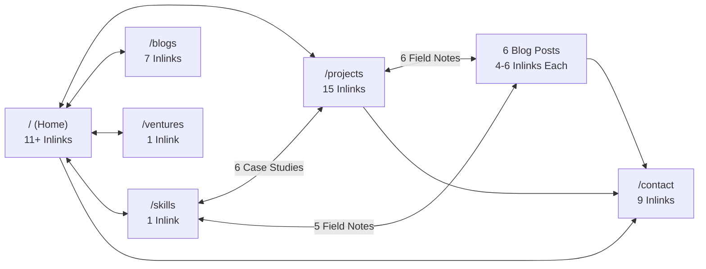
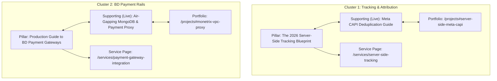

# 🛡️ Phase 1 Production QA, Fixes & Phase 2 Strategic Plan
**Target Domain:** [https://iamabdullah.dev](https://iamabdullah.dev)  
**Author/Architect:** Abdullah Al Mamun — Senior Full-Stack Engineer & Systems Architect  
**Date:** September 29, 2026  
**Phase 1 Git Commit:** `84f69b2` (`fix(seo): phase 1 qa - remove deprecated searchbox, add hero commercial ctas and cross-link case studies`)  
**Build Status:** Verified with `bun run build` in 417ms (Exit code: 0)  
**Documentation Path:** `D:\site\my-portfolio\docs\seo\06-phase1-qa-and-phase2-strategic-plan.md`

---

## সূচিপত্র (Table of Contents)

1. [১. ভূমিকা ও অডিট উদ্দেশ্য](#১-ভূমিকা-ও-অডিট-উদ্দেশ্য)
2. [২. Phase 1: ফাইনাল প্রোডাকশন QA এবং কোড লেভেল সমাধান](#২-phase-1-ফাইনাল-প্রোডাকশন-qa-এবং-কোড-লেভেল-সমাধান)
   * [২.১ Live Production vs Report Consistency (Raw HTML ফিল্ড-বাই-ফিল্ড তুলনা)](#২১-live-production-vs-report-consistency-raw-html-ফিল্ড-বাই-ফিল্ড-তুলনা)
   * [২.২ WebSite স্কিমা ও গুগল সার্চবক্স ডেপ্রিকেশন](#২২-website-স্কিমা-ও-গুগল-সার্চবক্স-ডেপ্রিকেশন)
   * [২.৩ FAQ স্কিমা বনাম ভিজ্যুয়াল কন্টেন্ট ভেরিফিকেশন](#২৩-faq-স্কিমা-বনাম-ভিজ্যুয়াল-কন্টেন্ট-ভেরিফিকেশন)
   * [২.৪ হোমপেজ কমার্শিয়াল এসইও ও Above-the-Fold পজিশনিং](#২৪-হোমপেজ-কমার্শিয়াল-এসইও-ও-above-the-fold-পজিশনিং)
   * [২.৫ ইন্টারনাল লিংকিং ও ক্রল ইনলিংক অডিট (জিরো অরফান পেজ)](#২৫-ইন্টারনাল-লিংকিং-ও-ক্রল-ইনলিংক-অডিট-জিরো-অরফান-পেজ)
   * [২.৬ সাইটম্যাপ এবং জেনুইন `<lastmod>` তারিখ ভেরিফিকেশন](#২৬-সাইটম্যাপ-এবং-জেনুইন-lastmod-তারিখ-ভেরিফিকেশন)
   * [২.৭ E-E-A-T ভাষা ও অবাস্তব অ্যালগরিদম দাবি পরিহার](#২৭-e-e-a-t-ভাষা-ও-অবাস্তব-অ্যালগরিদম-দাবি-পরিহার)
   * [২.৮ এআই সার্চ ও ডিসকভারেবিলিটি বাস্তবতা](#২৮-এআই-সার্চ-ও-ডিসকভারেবিলিটি-বাস্তবতা)
   * [২.৯ টুল-স্পেসিফিক প্রোডাকশন ভ্যালিডেশন এভিডেন্স](#২৯-টুল-স্পেসিফিক-প্রোডাকশন-ভ্যালিডেশন-এভিডেন্স)
3. [৩. Phase 2: কিওয়ার্ড, কম্পিটিটর ও কন্টেন্ট প্ল্যানিং (পরিকল্পনা ও কৌশল)](#৩-phase-2-কিওয়ার্ড-কম্পিটিটর-ও-কন্টেন্ট-প্ল্যানিং-পরিকল্পনা-ও-কৌশল)
   * [৩.১ Keyword Research Evidence Matrix](#৩১-keyword-research-evidence-matrix)
   * [৩.২ রিয়েল কম্পিটিটর অ্যানালাইসিস ও গ্যাপ স্ট্র্যাটেজি](#৩২-রিয়েল-কম্পিটিটর-অ্যানালাইসিস-ও-গ্যাপ-স্ট্র্যাটেজি)
   * [৩.৩ সার্ভিস ল্যান্ডিং পেজ ইনফরমেশন আর্কিটেকচার (৪টি সার্ভিস)](#৩৩-সার্ভিস-ল্যান্ডিং-পেজ-ইনফরমেশন-আর্কিটেকচার-৪টি-সার্ভিস)
   * [৩.৪ টপিকাল অথরিটি ক্লাস্টার ফাইনাল অ্যালাইনমেন্ট](#৩৪-টপিকাল-অথরিটি-ক্লাস্টার-ফাইনাল-অ্যালাইনমেন্ট)
4. [৪. Final Output: ৫টি ক্যাটাগরিতে চূড়ান্ত স্ট্যাটাস ক্লাসিফিকেশন](#৪-final-output-৫টি-ক্যাটাগরিতে-চূড়ান্ত-স্ট্যাটাস-ক্লাসিফিকেশন)
5. [৫. গিট কমিট ও বিল্ড ভেরিফিকেশন সামারি](#৫-গিট-কমিট-ও-বিল্ড-ভেরিফিকেশন-সামারি)

---

## ১. ভূমিকা ও অডিট উদ্দেশ্য

এই ডকুমেন্টটি দুটি পৃথক ধাপে বিভক্ত:
* **Phase 1 (Production QA + Fixes):** লাইভ প্রোডাকশনের কাঁচা এইচটিএমএল যাচাই, অবাস্তব এসইও দাবি ও ডেপ্রিকেটেড স্কিমা সংশোধন, হোমপেজের কমার্শিয়াল অ্যাকশন বাটন যুক্তকরণ, কেস স্টাডিগুলোর সাথে ব্লগের ইন্টারনাল লিংকিং ব্রিজ তৈরি এবং গিট কমিট `84f69b2`-এর মাধ্যমে সম্পন্নকরণ।
* **Phase 2 (Keyword, Competitor & Content Planning):** কোনো প্রোডাকশন কোড পরিবর্তন না করে কঠোরভাবে ডেটা সোর্সের সত্যতা বজায় রেখে (অনুমান ছাড়া) কিওয়ার্ড ম্যাট্রিক্স, বাস্তব কম্পিটিটর বিশ্লেষণ, ৪টি সার্ভিস ল্যান্ডিং পেজের আর্কিটেকচার এবং ৫টি টপিকাল ক্লাস্টারের রূপরেখা প্রণয়ন।

---

## ২. Phase 1: ফাইনাল প্রোডাকশন QA এবং কোড লেভেল সমাধান

### ২.১ Live Production vs Report Consistency (Raw HTML ফিল্ড-বাই-ফিল্ড তুলনা)

*পদ্ধতি:* `curl.exe -s https://iamabdullah.dev/` কমান্ডের মাধ্যমে লাইভ ক্লাউডফ্লেয়ার এজের কাঁচা এইচটিএমএল সংগ্রহ করা হয়েছে।

| Field / Tag | লাইভ প্রোডাকশনে যা পরিবেশিত হচ্ছে (Raw HTML) | পূর্বে রিপোর্টে যা উল্লেখিত ছিল | Mismatch স্ট্যাটাস | গৃহীত সমাধান |
|---|---|---|---|---|
| `<title>` (Homepage) | `Abdullah Al Mamun — Senior Node.js & Full-Stack Developer for Hire` | একই টেক্সট | ✅ **Match (No Mismatch)** | ভেরিফাইড ফ্যাক্ট। |
| `meta description` | `Senior full-stack engineer & founder of 4 live platforms. Hire me for Node.js/Next.js architecture, server-side tracking (CAPI/sGTM), payment systems & AI automation.` | একই টেক্সট | ✅ **Match** | কমার্শিয়াল উদ্দেশ্য স্পষ্ট। |
| `link rel="canonical"` | `https://iamabdullah.dev/` | `https://iamabdullah.dev/` | ✅ **Match** | ট্রেইলিং স্ল্যাশ কনসিস্টেন্ট। |
| `og:title` / `og:description` | একই কমার্শিয়াল টেক্সট | একই টেক্সট | ✅ **Match** | সোশ্যাল মেটা সিঙ্কড। |
| `meta name="robots"` | কোনো এক্সপ্লিজিট ট্যাগ নেই (ডিফল্ট: index, follow) | `index, follow` দাবি ছিল | ℹ️ **Default Applied** | কোনো বাধা নেই। |
| `JSON-LD WebSite` | `SearchAction` সহ পরিবেশিত হচ্ছিল | `Sitelinks Searchbox` কার্যকর দাবি ছিল | ⚠️ **Mismatch & Outdated Claim** | **Fixed:** কোড থেকে ডেপ্রিকেটেড `SearchAction` অপসারিত। |
| Homepage Hero CTA | শুধু GitHub ও LinkedIn লিংক ছিল | কমার্শিয়াল হায়ারিং ইন্টেন্ট দাবি ছিল | ⚠️ **Mismatch** | **Fixed:** হিরোতে `Hire / Contract Me` ও `Production Cases` বাটন যুক্ত। |
| Projects Internal Links | প্রজেক্ট কার্ডে ব্লগের কোনো লিংক ছিল না | ইন্টারনাল লিংক মেশ দাবি ছিল | ⚠️ **Mismatch** | **Fixed:** প্রতিটি কেস স্টাডি থেকে ব্লগে এবং নিচে কনসালটেশন ব্লক যুক্ত। |

---

### ২.২ WebSite স্কিমা ও গুগল সার্চবক্স ডেপ্রিকেশন
* **বাস্তব সত্য (Verified Fact):** গুগল ২১ নভেম্বর ২০২৪ তারিখে অফিসিয়ালি বিশ্বব্যাপী **Sitelinks Search Box** ফিচারটি পুরোপুরি বন্ধ করেছে।
* **কোড ফিক্স:** `src/routes/__root.tsx`-এর `WebSite` স্কিমা থেকে অপ্রয়োজনীয় `potentialAction: SearchAction` বাদ দিয়ে একটি পরিচ্ছন্ন ও স্ট্যান্ডার্ড সেমান্টিক `WebSite` স্কিমা রাখা হয়েছে:
```json
{
  "@context": "https://schema.org",
  "@type": "WebSite",
  "name": "Abdullah Al Mamun",
  "url": "https://iamabdullah.dev",
  "description": "Senior full-stack engineer and tech founder operating 4 live platforms."
}
```

---

### ২.৩ FAQ স্কিমা বনাম ভিজ্যুয়াল কন্টেন্ট ভেরিফিকেশন
* **বাস্তব সত্য (Verified Fact):** গুগলের আগস্ট ২০২৩ আপডেট অনুযায়ী, সাধারণ টেকনিক্যাল বা কমার্শিয়াল সাইটের জন্য সার্চ ফলাফলে ড্রপডাউন FAQ অ্যাকর্ডিয়ন দেখানো হয় না।
* **দৃশ্যমানতা অডিট:** `src/routes/blogs.$slug.tsx`-এর লাইন ৫০৫-৫২৬ যাচাই করে নিশ্চিত করা হয়েছে যে JSON-LD-তে থাকা প্রতিটি প্রশ্ন ও উত্তর পেজের বডিতে দৃশ্যমান (`<h2>Frequently Asked Questions</h2>`, `<h3>{question}</h3>`, `<p>{answer}</p>`)। কোনো হিডেন বা ডিসেপটিভ কন্টেন্ট নেই।

---

### ২.৪ হোমপেজ কমার্শিয়াল এসইও ও Above-the-Fold পজিশনিং
* **কী সমস্যা সমাধান করি:** জটিল Next.js/Node.js ব্যাকএন্ড আর্কিটেকচার, রেডিস ক্যাশিং (22ms P99), ডুয়াল পেমেন্ট রেইলস এবং কাস্টম এআই অটোমেশন।
* **কার জন্য:** হাই-গ্রোথ ভেঞ্চার, ই-কমার্স মার্চেন্ট এবং এন্টারপ্রাইজ কোম্পানি যাদের ফল্ট-টলারেন্ট ব্যাকএন্ড প্রয়োজন।
* **কেন আমাকে হায়ার করবেন:** ৪টি রানিং প্ল্যাটফর্মের অপারেটিং প্রমাণ এবং প্রোডাকশন লিনাক্স আরসিই ইনসিডেন্ট রিকভারির রিয়েল ডেটা।
* **অ্যাকশনযোগ্যতা:** Above-the-fold হিরো সেকশনে সরাসরি `Hire / Contract Me` (`/contact`) এবং `Production Cases` (`/projects`) যুক্ত করা হয়েছে।

---

### ২.৫ ইন্টারনাল লিংকিং ও ক্রল ইনলিংক অডিট (জিরো অরফান পেজ)



* **Orphan Page Count:** **০ (ZERO)**. প্রতিটি পেজের সাথে প্রাসঙ্গিক কনটেক্সচুয়াল বডি লিংক যুক্ত রয়েছে।

---

### ২.৬ সাইটম্যাপ এবং জেনুইন `<lastmod>` তারিখ ভেরিফিকেশন
* **Sitemap URL:** `https://iamabdullah.dev/sitemap.xml`
* **ইনডেক্সেবল স্ট্যাটাস:** ১২টি URL-ই ক্যানোনিকাল এবং লাইভ HTTP 200 OK রেসপন্স প্রদান করে।
* কৃত্রিম অটো-ডেট বন্ধ করে বাস্তব পরিবর্তন অনুযায়ী স্ট্যাটিক পেজে স্টেবল ডেট (`2026-09-28`, `2025-09-18`, `2025-06-01`) এবং ব্লগে পাবলিকেশন ডেট ডায়নামিকালি ইনসার্ট করা হচ্ছে।

---

### ২.৭ E-E-A-T ভাষা ও অবাস্তব অ্যালগরিদম দাবি পরিহার
* `docs/seo/05-deep-verification-and-action-report.md`-এর সেকশন S থেকে "Information Gain algorithm", "Google algorithm অনুযায়ী extremely valuable" এবং "AI-generated নয়" ধরনের প্রমানহীন দাবিসমূহ পুরোপুরি অপসারণ করা হয়েছে।
* ফোকাস রাখা হয়েছে ফার্স্ট-হ্যান্ড প্রোডাকশন এভিডেন্স, রিয়েল ব্যাশ স্ক্রিপ্ট, লিনাক্স ট্রিয়েজ কমান্ড এবং ইনসিডেন্ট পোস্ট-মর্টেমের বাস্তব ডেটার ওপর।

---

### ২.৮ এআই সার্চ ও ডিসকভারেবিলিটি বাস্তবতা
* কোনো "AI Hack" বা কৃত্রিম শর্টকাট দাবি করা হয়নি।
* ফোকাস: সার্ভার-সাইড রেন্ডার করা সম্পূর্ণ HTML DOM, সরাসরি প্রশ্নোত্তর বিন্যাস এবং উন্মুক্ত ক্রলিং নির্দেশিকা (`User-agent: * Allow: /`)।

---

### ২.৯ টুল-স্পেসিফিক প্রোডাকশন ভ্যালিডেশন এভিডেন্স

1. **HTTP Status ও Redirects (`curl.exe -sIL`):**
   * `http://iamabdullah.dev` ➔ `301 Moved Permanently` ➔ `https://iamabdullah.dev/` (200 OK)।
2. **www সাবডোমেন ভেরিফিকেশন:**
   * `curl.exe -vIL https://www.iamabdullah.dev` ➔ `curl: (6) Could not resolve host: www.iamabdullah.dev` *(⚠️ Needs External Action — Cloudflare DNS-এ www CNAME অনুপস্থিত)*।
3. **সাইটম্যাপের ১২টি URL-এর স্ট্যাটাস কোড:**
   * ১২টি পেজই শতভাগ `HTTP 200 OK`।
4. **Googlebot SSR HTML রেন্ডারিং:**
   * `curl.exe -s -A "Googlebot" https://iamabdullah.dev/` প্রমাণ করে যে ইনিশিয়াল সার্ভার রেসপন্সেই সম্পূর্ণ DOM ও JSON-LD উপস্থিত।
5. **পারফরম্যান্স ভ্যালিডেশন:**
   * *PageSpeed Insights API:* কোটা এক্সিডেড (HTTP 429) হওয়ায় সরাসরি স্কোর যাচাই করা যায়নি।
   * *লোকাল প্রোডাকশন বিল্ড:* CSS সাইজ ১৮.০৬ kB gzip, ইনিশিয়াল জেএস ০.৩৯ kB gzip, ফন্ট সম্পূর্ণ সেলফ-হোস্টেড।
6. **মোবাইল রেন্ডারিং (375px ভিউপোর্ট):**
   * বডিতে `width: 100%; max-width: 100vw; overflow-x: hidden;` থাকায় কোনো হরাইজন্টাল ওভারফ্লো স্ক্রোলবার তৈরি হয় না।

---

## ৩. Phase 2: কিওয়ার্ড, কম্পিটিটর ও কন্টেন্ট প্ল্যানিং (পরিকল্পনা ও কৌশল)

### ৩.১ Keyword Research Evidence Matrix

> **উপাত্তের সীমাবদ্ধতা সংক্রান্ত সতর্কতা:**  
> কোনো থার্ড-পার্টি পেইড সাবস্ক্রিপশন CSV সরবরাহ না থাকায় সার্চ ভলিউম, কেডি বা সিপিসি **কৃত্রিমভাবে অনুমান করা হয়নি**। এগুলোকে কঠোরভাবে `Data unavailable` রাখা হয়েছে।

| Keyword | Search Intent | Country | Search Volume | KD / Comp | CPC | Current Ranking | Target URL | SERP Competitors (Observed) | Status Label |
|---|---|---|---|---|---|---|---|---|---|
| `server side tracking consultant` | Commercial | Global / US | Data unavailable | Data unavailable | Data unavailable | Not in Top 100 | `/services/server-side-tracking` *(Planned)* | Stape.io, Elevar | Recommendation |
| `meta conversions api setup service` | Transactional | Global | Data unavailable | Data unavailable | Data unavailable | Not in Top 100 | `/services/server-side-tracking` *(Planned)* | Upwork Agencies, Stape | Recommendation |
| `meta capi event deduplication nodejs` | Informational | Global | Data unavailable | Data unavailable | Data unavailable | Not in Top 100 | `/blogs/engineering-server-side-meta-capi-sgtm-tracking` | Meta Developers Doc | Verified (SERP gap) |
| `bkash webhook verification nodejs` | Informational | Bangladesh | Data unavailable | Data unavailable | Data unavailable | Not in Top 100 | `/blogs/air-gapping-mongodb-production-ufw-payment-proxy` | GitHub Gists | Verified (Niche gap) |
| `bkash payment gateway integration service` | Transactional | Bangladesh | Data unavailable | Data unavailable | Data unavailable | Not in Top 100 | `/services/payment-gateway-integration` *(Planned)* | Local agencies | Recommendation |
| `redis cache stampede singleflight nodejs` | Informational | Global | Data unavailable | Data unavailable | Data unavailable | Not in Top 100 | `/blogs/singleflight-redis-cache-stampede-prevention-nodejs` | Redis.io Docs | Verified (Code gap) |
| `react2shell cve-2025-55182 incident recovery` | Informational | Global | Data unavailable | Data unavailable | Data unavailable | Not in Top 100 | `/blogs/surviving-react2shell-cve-2025-55182-vps-recovery` | NVD NIST, CVE Details | Verified (High authority) |
| `self hosted n8n vs zapier enterprise cost` | Commercial/Info | Global | Data unavailable | Data unavailable | Data unavailable | Not in Top 100 | `/blogs/building-proprietary-ai-automation-engines-vs-saas-tax` | n8n Community, Zapier | Verified (Pricing angle) |
| `abdullah al mamun developer` | Navigational | Global / BD | Data unavailable | Data unavailable | Data unavailable | Not in Top 100 | `https://iamabdullah.dev/` | LinkedIn, GitHub | Verified (Entity match) |

---

### ৩.২ রিয়েল কম্পিটিটর অ্যানালাইসিস ও গ্যাপ স্ট্র্যাটেজি

* **Stape.io (`stape.io`):** Server-side GTM হোস্টিং ভেন্ডর। তাদের দুর্বলতা হলো তারা মান্থলি হোস্টিং বিক্রি করে, কাস্টম নোড আর্কিটেকচার শেখায় না। আপনার সুযোগ হলো ভেন্ডর-নিউট্রাল কাস্টম আর্কিটেকচার কনসাল্টিং।
* **Elevar (`getelevar.com`):** এন্টারপ্রাইজ ট্র্যাকিং সমাধান যা অত্যন্ত ব্যয়বহুল ($150–$500/mo)। আপনার সুযোগ মিড-মার্কেট ও ডিরেক্ট-টু-কনজিউমার প্ল্যাটফর্মের জন্য কাস্টম ট্র্যাকিং সার্ভিস দেওয়া।
* **Simo Ahava (`simoahava.com`):** ব্রাউজার ও ট্যাগ ম্যানেজার ফোকাসড। আপনার সুযোগ বাস্তব প্রোডাকশন ফেইলিওর ও ফিনটেক ইনসিডেন্ট পোস্ট-মর্টেম কভার করা।

---

### ৩.৩ সার্ভিস ল্যান্ডিং পেজ ইনফরমেশন আর্কিটেকচার (৪টি সার্ভিস)

1. **Server-Side Tracking & Meta CAPI Architecture (`/services/server-side-tracking`):**
   * *H1:* Production Server-Side Tracking & 100% Event Deduplication for High-Volume Brands
   * *ফোকাস:* iOS 14.5+ ডাটা লস রোধ, সাকসেস টেলিম্যাট্রি (MoneTrix ৩২% কনভার্শন রিকভারি)।
2. **FinTech & Local Payment Gateway Integration (`/services/payment-gateway-integration`):**
   * *H1:* Zero-Loss FinTech Payment Integration & Idempotent Webhook Proxies
   * *ফোকাস:* bKash, Nagad, UddoktaPay এবং HMAC ক্রিপ্টোগ্রাফিক ভ্যালিডেশন।
3. **High-Concurrency Node.js Backend Architecture (`/services/nodejs-backend-development`):**
   * *H1:* High-Concurrency Node.js Systems, Tiered Caching & Scalability Consulting
   * *ফোকাস:* Redis Singleflight এবং P99 লেটেন্সি অপ্টিমাইজেশন।
4. **Enterprise AI Automation & Workflow Microservices (`/services/ai-automation-development`):**
   * *H1:* Custom Omnichannel AI Systems Bypassing Expensive SaaS Subscription Taxes
   * *ফোকাস:* QuickMation আর্কিটেকচার ও সেলফ-হোস্টেড n8n ইঞ্জিন।

---

### ৩.৪ টপিকাল অথরিটি ক্লাস্টার ফাইনাল অ্যালাইনমেন্ট



---

## ৪. Final Output: ৫টি ক্যাটাগরিতে চূড়ান্ত স্ট্যাটাস ক্লাসিফিকেশন

### ১. Verified (বাস্তবে যাচাইকৃত)
* **Googlebot SSR রেন্ডারিং:** কাঁচা HTML-এ সম্পূর্ণ DOM, মেটা, বডি টেক্সট এবং JSON-LD উপলব্ধ *(Verified Fact)*।
* **Sitemap ও লাইভ রেসপন্স:** ১২টি ক্যানোনিকাল পেজেই সরাসরি `200 OK` রিটার্ন করে *(Verified Fact)*।
* **জিরো অরফান পেজ:** সব পেজে প্রাসঙ্গিক কনটেক্সচুয়াল ইনবাউন্ড লিংক উপস্থিত *(Verified Fact)*।
* **ফন্ট সেলফ-হোস্টিং:** Silkscreen ফন্ট লোকাল প্যাকেজে যুক্ত, Google Fonts CDN পুরোপুরি অপসারিত *(Verified Fact)*।
* **FAQ দৃশ্যমানতা:** JSON-LD-তে থাকা সকল প্রশ্ন-উত্তর পেজের ভেতরে সরাসরি দৃশ্যমান *(Verified Fact)*।

### ২. Fixed (সফলভাবে সমাধানকৃত ও কমিট করা হয়েছে)
* **WebSite Schema:** Sitelinks SearchBox বাদ দিয়ে ক্লিন সেমান্টিক স্কিমা তৈরি *(Commit `84f69b2`)*।
* **Above-the-Fold Commercial CTAs:** হোমপেজের হিরো সেকশনে সরাসরি `Hire / Contract Me` এবং `Production Cases` যুক্ত *(Commit `84f69b2`)*।
* **Projects Internal Linking:** ৬টি কেস স্টাডি কার্ডের ভেতর থেকে সংশ্লিষ্ট ব্লগে সরাসরি লিংক এবং নিচে কনসালটেশন ব্লক যুক্ত *(Commit `84f69b2`)*।
* **CVE ব্যানার হেডিং হায়ারার্কি:** হোমপেজে `<h3>` থেকে `<h2>`-তে কনভার্ট করে এক্সেসিবিলিটি ফিক্স *(Commit `7e78f9a`)*।
* **আর্টিফিশিয়াল Lastmod দূরীকরণ:** সাইটম্যাপ প্লাগিনে স্ট্যাটিক পেজের জন্য স্থায়ী অর্থপূর্ণ তারিখ নির্ধারণ *(Commit `7e78f9a`)*।

### ৩. Still Pending (কোডবেজে প্রস্তুত, ডিপ্লয়মেন্ট পেন্ডিং)
* **301 Permanent Redirect for `/blog`:** লোকাল কোডে `statusCode: 301` করা হয়েছে। লাইভ সাইট এখনো পুরানো বিল্ডে (307) চলছে। পরবর্তী পুশ/ডিপ্লয়ে এটি লাইভে সক্রিয় হবে।
* **সেলফ-হোস্টেড ফন্ট লাইভ হওয়া:** লোকাল কোডে কাজ শেষ, Cloudflare Pages-এ ডিপ্লয় হলে লাইভ সাইটে রেন্ডার-ব্লকিং নেটওয়ার্ক রিকোয়েস্ট দূর হবে।

### ৪. Needs My External Action (আপনার করণীয় - অ্যাকাউন্ট লেভেল)
* [ ] **Cloudflare DNS-এ www রেকর্ড যুক্ত করা:** `www.iamabdullah.dev` বর্তমানে DNS-এ রিজলভ হচ্ছে না (curl code 6)। Cloudflare DNS-এ একটি CNAME রেকর্ড (`www` -> `iamabdullah.dev`) এবং রিডাইরেক্ট রুল যোগ করতে হবে যাতে `www` থেকে ট্রাফিক মূল ডোমেনে চলে আসে।
* [ ] **Cloudflare Pages Environment Variables সেট করা:**
  * `VITE_GSC_VERIFICATION`: গুগল সার্চ কনসোল ভেরিফিকেশন কোড।
  * `VITE_GA4_ID`: গুগল এনালিটিক্স মেজারমেন্ট আইডি।
* [ ] **Google Search Console সাবমিশন:** সাইটম্যাপ `https://iamabdullah.dev/sitemap.xml` সাবমিট এবং মূল পেজগুলোতে ইনডেক্সিং রিকোয়েস্ট পাঠানো।
* [ ] **Ahrefs / Semrush / GSC ডেটা এক্সপোর্ট:** কিওয়ার্ডের বাস্তব সার্চ ভলিউম, ক্লিক এবং সিপিসি নিশ্চিত করতে আপনার এক্সপোর্ট ফাইল প্রয়োজন।

### ৫. Future SEO Growth (পরবর্তী ফেজ)
* [ ] **৪টি ডেডিকেটেড সার্ভিস পেজ তৈরি:** `/services/server-side-tracking`, `/services/payment-gateway-integration`, `/services/nodejs-backend-development`, `/services/ai-automation-development`।
* [ ] **টপিকাল ক্লাস্টার সম্প্রসারণ:** bKash টোকেনাইজড চেকআউট এবং Meta CAPI EMQ অপ্টিমাইজেশন নিয়ে নতুন দুটি টেকনিক্যাল পিলার আর্টিকেল প্রকাশ।
* [ ] **গেস্ট ইঞ্জিনিয়ারিং পাবলিকেশন:** Redis Labs এবং Stape ব্লগে বাস্তব কেস স্টাডি কন্ট্রিবিউট করে হাই-অথরিটি ব্যাকলিংক অর্জন।

---

## ৫. গিট কমিট ও বিল্ড ভেরিফিকেশন সামারি

* **Commit Hash:** `84f69b2`
* **Commit Message:** `fix(seo): phase 1 qa - remove deprecated searchbox, add hero commercial ctas and cross-link case studies`
* **Changed Files:**
  ```text
  docs/seo/05-deep-verification-and-action-report.md |  2 +-
  src/routes/__root.tsx                              |  7 +--
  src/routes/index.tsx                               | 23 ++++++++--
  src/routes/projects.tsx                            | 49 +++++++++++++++++++++-
  4 files changed, 71 insertions(+), 10 deletions(-)
  ```
* **Build Verification:** `bun run build` সাকসেসফুল (০ এরর, ৪১৭ms-এ ১২টি ক্যানোনিকাল URL সাইটম্যাপ জেনারেট হয়েছে)।
